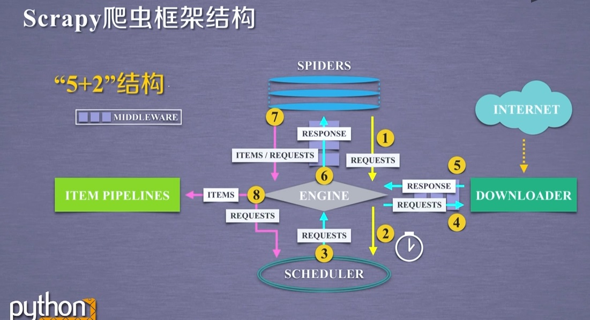

#### 安装

```py
#安装命令
pip  install scrapy
#查看帮助
scrapy -h
```

#### 说明

```sh
#scrapy框架，5+2结构，即5个模块和2个中间件
#模块数据流：
1) SPIDERS (携带requests)-> ENGINE -> SCHEDULER
2.1) SCHEDULER (携带requests) -> ENGINE (requests) -> DOWNLOADER (from internet)
2.2) DOWNLOADER (response) -> ENGINE -> SPIDERS
3) SPIDERS (items) -> ENGINE -> ITEM PIPELNIES
3.2) SPIDERS (requests) -> ENGINE -> SCHEDULER

#说明：
	ENGINE,SCHEDULER,DOWNLOADER模块为已有实现
	SPIDERS,ITEM PIPELINES需用户编写，配置

#SPIDERS模块功能：
	解析response
	产生爬取项（item）
	产生额外请求（requests）

#ITEM PIPELINES模块功能：
	以流水线方式处理spider产生的爬取项
	操作顺序组成，每个操作时一个Item Pipeline类型
	可能操作包括：清理，检验和查看爬取项中的html数据，将数据存储到数据库

#中间件Downloader Middleware
	实施Engine，Scheduler和Downloader之间进行用户可配置的控制
	修改，丢弃，新增请求或响应
	
#中间件Spider Middleware
	对请求和爬取项的再处理，用户配置
	修改，丢弃，新增请求或爬取项
```

+ 附框架图

   

#### 常用命令

```sh
#语法（命令行）
scrapy <command> [options] [args]
```

| 命令         | 说明               | 格式                                       |
| ------------ | ------------------ | ------------------------------------------ |
| startproject | 创建一个新工程     | scrapy startproject <name> [dir]           |
| genspider    | 创建一个爬虫       | scrapy genspider [options] <name> <domain> |
| settings     | 获取爬虫配置信息   | scrapy settings [options]                  |
| crawl        | 运行一个爬虫       | scrapy crawl <spider>                      |
| list         | 列出工程中所有爬虫 | scrapy list                                |
| shell        | 启动URL调试命令行  | scrapy shell [url]                         |

#### 工程介绍

##### 1.创建工程

```sh
#创建工程命令
scrapy startproject scrapytest
```

此时目录下会生成一个`scrapytest`目录，结构如下：

```sh
scrapytest/				#外层目录
  ++ scrapy.cfg			#部署配置文件（服务器相关）
  ++ scrapytest/		#scrapy框架用户自定义代码
    ++ __init__.py		#初始化脚本
    ++ items.py			#Items代码模板（继承类）
    ++ middlewares.py	#Middlewares代码模板（继承类）
    ++ pipelines.py		#Pipelines代码模板（继承类）
    ++ settings.py		#Scrapy爬虫的配置文件
    ++ spiders/			#Spiders代码模板目录（继承类）
      ++ __init__.py	#初始文件，无需修改
      ++ __pycache__/	#缓存目录，无需修改
```

##### 2.创建爬虫

```sh
#在前面创建的工程scrapytest目录下
cd scrapytest
#创建爬虫"demo"，域名指向"www.xxx.com"，此时spiders目录下会生成demo.py文件
scrapy genspider demo www.xxx.com		
```

##### 3.爬虫配置示例

修改`demo.py`文件：

```py
import scrapy

class DemoSpider(scrapy.Spider):
	name = "demo"
    #allowed_domains = ["www.xxx.com"]
	start_urls = ["https://www.python123.io/ws/demo.html"]

	def parse(self, response):
		fname = response.url.split('/')[-1]
		# print("##################################: %s " % fname)
		with open(fname,'wb') as f:
			f.write(response.body)

		self.log("saved file %s." % fname)
```

##### 4.运行爬虫

```sh
#工程目录下，运行前面创建的爬虫“demo”
scrapy crawl demo 
```

<font color=red>可能报错说明：AttributeError: 'AsyncioSelectorReactor' object has no attribute '_handleSignals'</font> 

当前`Twisted版本23.8.0`与`scrapy`不兼容

**解决方案**：卸载`Twisted`，重新安装`Twisted版本22.10.0`

```sh
#解决方案
pip uninstall Twisted
#安装兼容版本
pip install Twisted==22.10.0
```

<font color=green>运行正常后，在工程目录`scrapytest`下生成`demo.html`文件</font>

#### Scrapy爬虫使用

```sh
#数据类型：
	#Request类
  		#class scrapy.http.Request()		
  		#Request对象表示一个http请求
  		#由Spider生成，由Downloader执行
  		#方法：
  			.url		#对应请求url
  			.method		#对应请求方法
  			.headers	#字典风格请求头
  			.body		#请求内容主题，字符串类型
  			.meta		#用户添加的扩展信息，在Scrapy内部模块间传递信息使用
  			.copy()		#复制该请求
	#Response类
		#class scrapy.http.Response()
		#Response对象表示一个http响应
		#由Downloader生成，由Spider处理
		#方法：
			.url		#Response对应的url网址
			.status		#http状态码，默认200
			.headers	#response对应头部信息
			.body		#response对应的内容信息，字符串类型
			.flags		#一组标记
			.request	#产生Response类型对应的Request对象
			.copy()		#复制该响应
	
	#Item类 
		#class scrapy.item.Item()
		#Item对象表示从一个html页面提取的信息内容
		#由Spider生成，由Item Pipeline处理
		#Item类似字典类型，可以按照字典类型操作
```

```sh
#Scrapy爬虫对html信息提取方法：
	#Beautiful Soup
	#lxml
	#re
	#XPath Selector
	#CSS Selector
		格式：<HTML>.css('a::attr(href)').extract()	#a为标签名称，href为标签属性
```

```sh
#开发步骤：
	1.创建工程和Spider模板
	2.编写Spider
	3.编写Item Pipeline
	4.编写Spider
```

