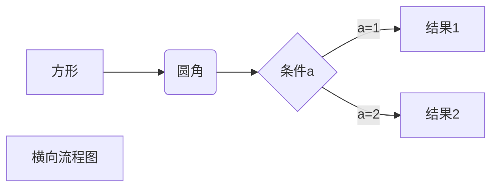
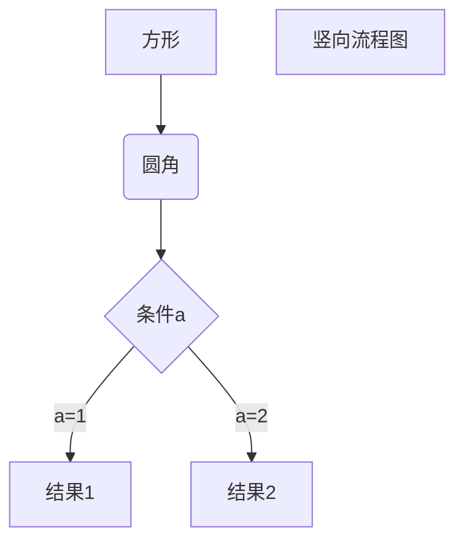
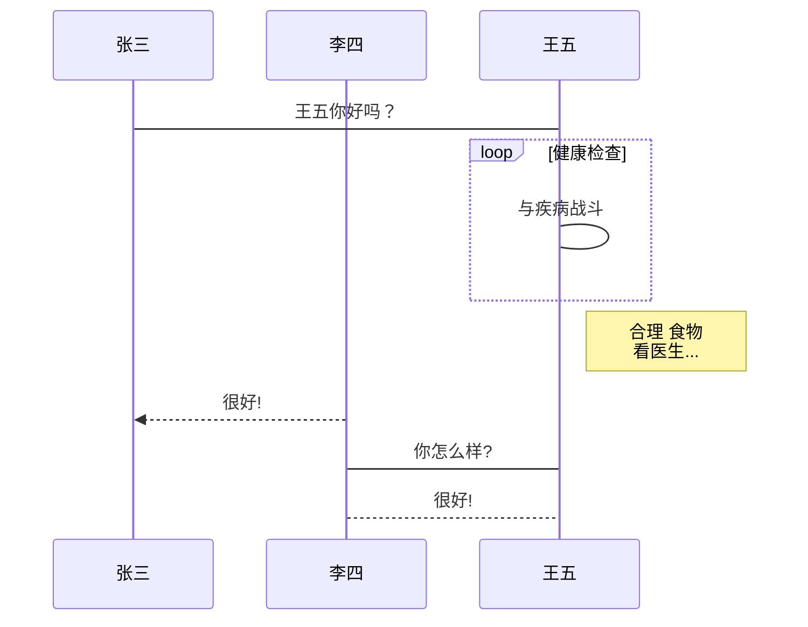

# 标题

## 二级标题
### 三级标题
#### 四级标题
##### 五级标题
###### 六级标题

标题2
====
二级标题
---

# 段落格式

*斜体* _斜体_  
**粗体** __粗体__  
***粗斜体*** ___粗斜体___  
***
~~删除线~~  
<u>下划线</u>  

脚注[^x]。

[^x]: 你好

# 列表

* 第一项
* 第二项

+ 第一项
+ 第二项

1. 第一项
2. 第二项
3. 第三项

### 列表嵌套

1. 第一项：
	- 第一项嵌套的第一个元素
	- 第一项嵌套的第二个元素
2. 第二项：
	- 第二项嵌套的第一个元素
	- 第二项嵌套的第二个元素

# 区块

> 区块引用  
> 菜鸟教程  
> 学的不仅是技术更是梦想

>dd
>>ddd
>>>dddd

>+ 111
>+ 222
>+ 333

# 代码

`print()`函数

```python
def test():
	print("hello world")
```

# 链接

[链接名称](链接地址)

或者

<https:www.baidu.com>

# 图片


# 表格

|  表头   | 表头  |
|  ----  | ----  |
| 单元格  | 单元格 |
| 单元格  | 单元格 |

 | 左对齐 | 右对齐 | 居中对齐 |
 | :-----| ----: | :----: |
 | 单元格 | 单元格 | 单元格 |
 | 单元格 | 单元格 | 单元格 |

 <table border="1">
 	<thead>
		<td width="100px;">sdfw</td>
		<td>sdfw</td>
	</thead>
	<tr>
	<tr>
		<td>sdfw</td>
		<td>sdfw</td>
	</tr>
	<tr>
		<td>sdfw</td>
		<td>sdfw</td>
	</tr>
 </table>

# 高级技巧

使用 <kbd>Ctrl</kbd>+<kbd>Alt</kbd>+<kbd>Del</kbd> 重启电脑

### 公式

$ f(x) = x+y $

$$
f(x) = x+y
$$

### 流程图
##### 1、横向流程图源码格式：


##### 2、竖向流程图源码格式：


##### 3、标准流程图源码格式：
```flow
st=>start: 开始框
op=>operation: 处理框
cond=>condition: 判断框(是或否?)
sub1=>subroutine: 子流程
io=>inputoutput: 输入输出框
e=>end: 结束框
st->op->cond
cond(yes)->io->e
cond(no)->sub1(right)->op
```

##### 4、标准流程图源码格式（横向）：
```flow
st=>start: 开始框
op=>operation: 处理框
cond=>condition: 判断框(是或否?)
sub1=>subroutine: 子流程
io=>inputoutput: 输入输出框
e=>end: 结束框
st(right)->op(right)->cond
cond(yes)->io(bottom)->e
cond(no)->sub1(right)->op
```

##### 5、UML时序图源码样例：
```sequence
对象A->对象B: 对象B你好吗?（请求）
Note right of 对象B: 对象B的描述
Note left of 对象A: 对象A的描述(提示)
对象B-->对象A: 我很好(响应)
对象A->对象B: 你真的好吗？
```

##### 6、UML时序图源码复杂样例：
```sequence
Title: 标题：复杂使用
对象A->对象B: 对象B你好吗?（请求）
Note right of 对象B: 对象B的描述
Note left of 对象A: 对象A的描述(提示)
对象B-->对象A: 我很好(响应)
对象B->小三: 你好吗
小三-->>对象A: 对象B找我了
对象A->对象B: 你真的好吗？
Note over 小三,对象B: 我们是朋友
participant C
Note right of C: 没人陪我玩
```

##### 7、UML标准时序图样例：



